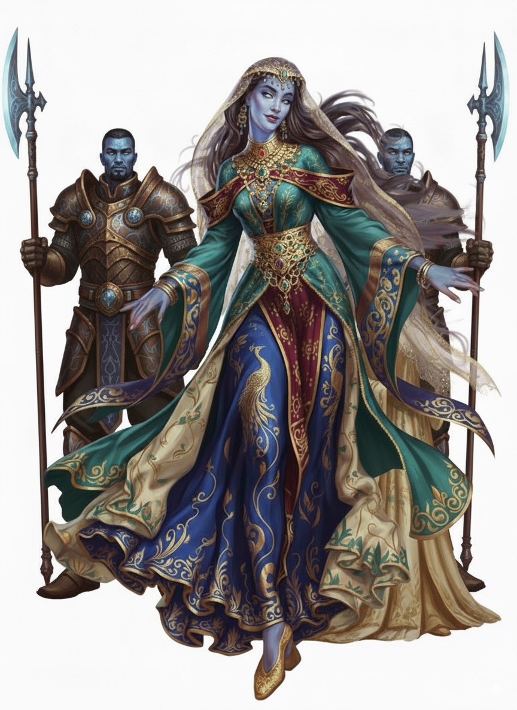

---
title: "Amirah Sephira Al-Marish"
sidebar_position: 1
---

Daughter of the majestic king Djinn Husam al-Bali ben Nafhat al-Yugayyim

/
Magister of the Clouds and Daughter of the Breeze

Rider of the Four Winds

Princess of the Birds

Defender of the Skies

Queen of all the Djinn of the winds of Levant

It is believed that she is the one that organizes the Tournament of
Valor in Nersand once every 100 years.
