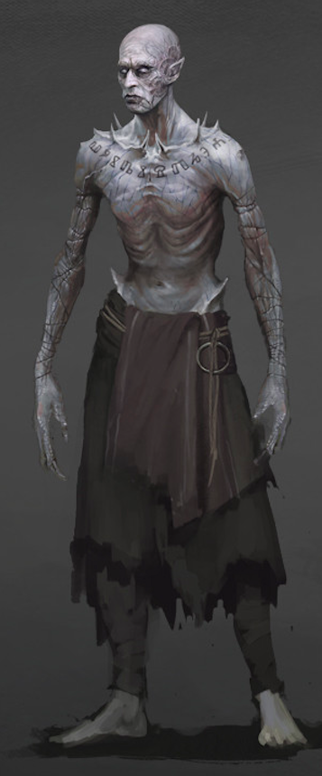

---
title: "Master Gloran Herzblatt"
sidebar_position: 3
---

He was the one behind the murders in Dorelta and seems to be doing some
kind of ritual deep behind the Crypt of the Herzblatt.

He used to disguise himself as Telrond Whiterose.

It happened to be Gloran Herzblatt, a member of the Herzblatt family who
apparently died many years ago but managed to stay alive as an undead
creature. After found he was trying to turn into a lich by means of some
dark ritual, but was stopped by the party.

Later on, it was discovered that he got a book from the private part of
the Temple of Knowledge provided to him by the Shadow Auctioneer.
