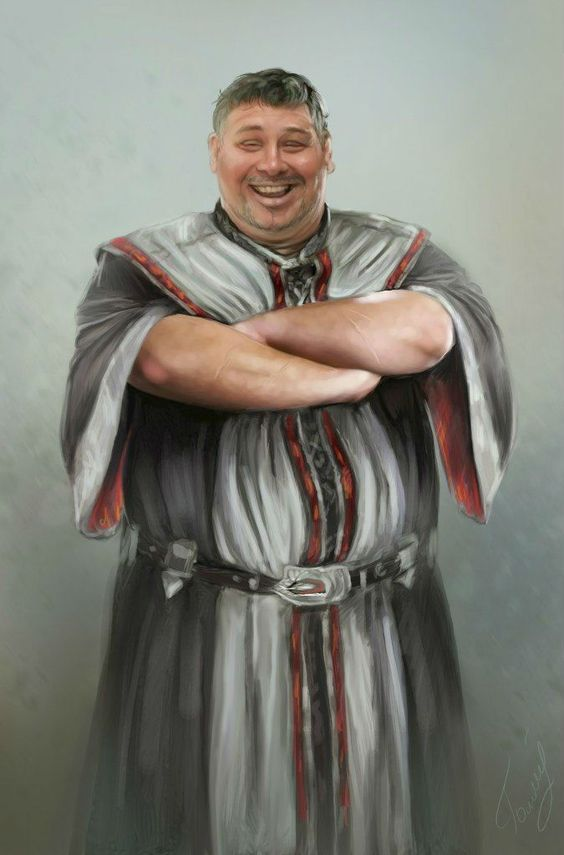

Middle age human.

He was found together with his horses inside a webbed cocoon after being
attacked by some Ettercaps and spiders.

It was rescued by a group of adventurers and one individual who was
inside a coffin that he was paid to carry no questions asked.

His job is to transport goods between cities the fastest possible. In
Dorelta his main contact is
[Lara](/docs/dorelta/dorelta-npcs/lara).

