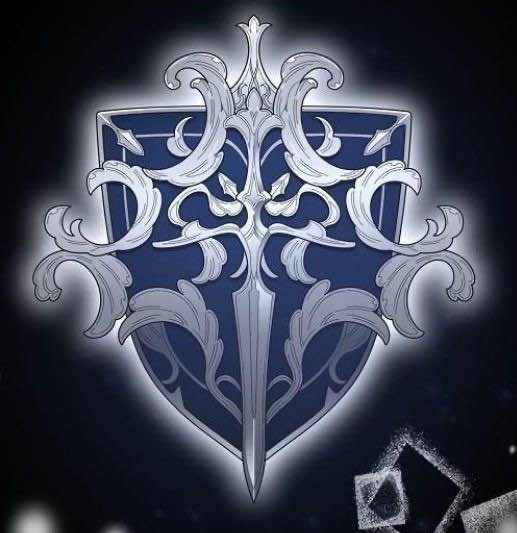

---
title: "Belmont's Crest"
sidebar_position: 10
---

## The Belmont Crest

The **Belmont Crest** is the symbol of the Belmont family.

It depicts a **silver sword upon a blue shield**, surrounded by elegant silver lines.

Despite the reputation attached to the Belmont name, [Kespien Belmont](/docs/players/kespien-belmont/) continues to openly wear the family crest. It can be seen prominently embroidered on his jacket.

The crest also appears on the blade of the broken longsword Kespien inherited from his father, Jean Belmont](/docs/factions/belmont-family/jean-belmont).

---

## Related Pages

- [Kespien Belmont](/docs/players/kespien-belmont/)
- [Belmont the Liar](/docs/factions/belmont-family/belmont-the-liar-song)

