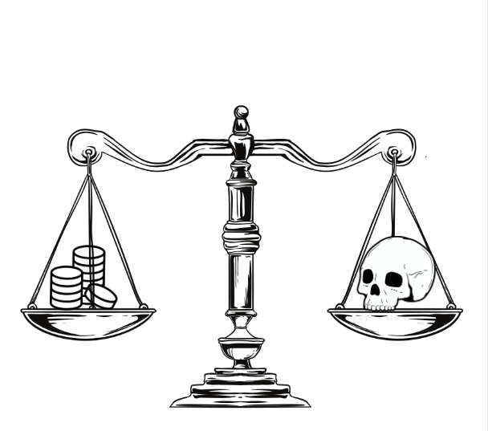

---
title: "Order of the white Scale"
sidebar_position: 7
---

Monastic order of followers of the Judge of the Dead Kelemvor located in
the Scales Hills, south of West Nevington. Its followers are known to
appear in areas where a major catastrophe with numerous deaths is about
to occur, or has already occurred to accompany the damned on the journey
to the other side. They usually remain neutral in the face of conflicts
and do not usually use their divine gifts to cure illnesses of those who
have already passed the threshold or those who decide that their time
has come.

 

They have sworn their lives to fight against any undead creature that
popullate the lands of Norberia.

 

 

