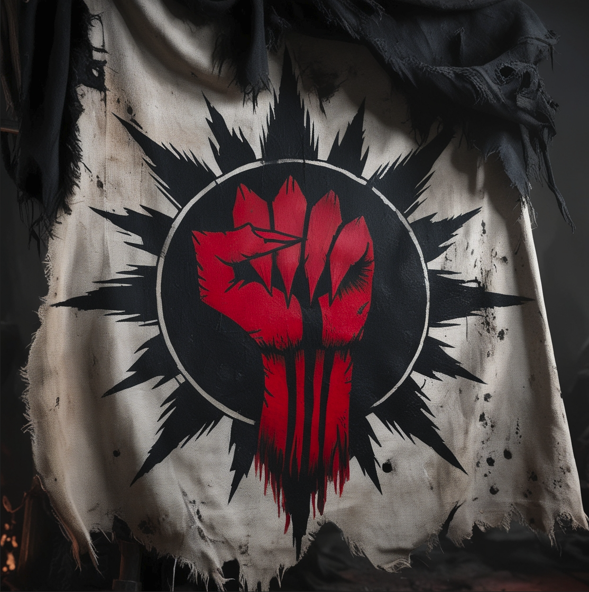

---
title: "Red Fangs tribe"
sidebar_position: 8
---

Thursday, November 13, 2025

3:03 PM

The Red Fangs are a militarized goblinoid tribe forged in the ruins of a
shattered hobgoblin legion. Survivors of an ancient campaign, they
merged with ogre clans and goblin scavengers to form a nomadic warband,
dedicated to conquest, vengeance, and the humiliation of the
�€œcivilized.�€? They see destruction as divine reclamation, tearing
down what soft races build, leaving only red-stained fangs and ash
behind.

They were the responsibles of the attack to Crosscove that ended with
the live of Kespien's parents. The Silvertusk Brotherhood saved Kespien
and dedicated some efforts on erradicating it. Apparently they weren't
totally destroyed because the Farbound Fellowship saw two hill giants
with tatoos on them for this tribe.

Dorn Firember also confirmed to Kespien that there have been reports
that they are active again.

