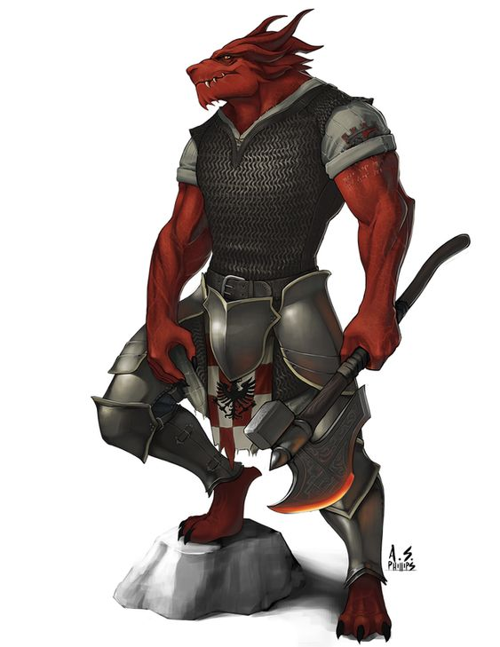

---
title: "Dorn Firember"
sidebar_position: 3
---

| | |
|---|---|
| **Affiliation** | [Silvertusk Brotherhood](/docs/factions/silvertusk-brotherhood/) |
| **Role** | Kespien's mentor and superior |
| **Connection** | Rescued and trained Kespien |

## Overview

**Dorn Firember** is a member of the [Silvertusk Brotherhood](/docs/factions/silvertusk-brotherhood/) and one of the most important figures in [Kespien Belmont's](/docs/players/kespien-belmont/) life.

Dorn rescued Kespien after the goblin raid that killed his parents and later brought him to [Mordian](/docs/regions/mauer-mountains/mordian), where he took the young Belmont under his wing.

---

## Mentor to Kespien

Dorn subjected Kespien to rigorous training, teaching him how to fight and helping transform the frail and impulsive boy into a disciplined adventurer.

His teachings also influenced some of Kespien's combat spells and eventually contributed to the fighting style Kespien developed as a Bladesinger.

Dorn is extremely demanding and places great importance on **discipline, training, and self-reliance**. His treatment of Kespien can often appear harsh, resembling that of a particularly strict father.

Despite this, Dorn clearly cares about his pupil and takes pride in his development.

---

## Kespien's First Mission

Dorn eventually entrusted Kespien with his first solo mission, sending him to [Dorelta](/docs/regions/autumn-forest/dorelta).

He instructed Kespien to meet him again in [Longsaddle](/docs/regions/longsaddle) once the mission was complete.

---

## Related Pages

- [Kespien Belmont](/docs/players/kespien-belmont/)
- [Birthday Sending from Dorn](/docs/players/kespien-belmont/birthday-sending-from-dorn)

