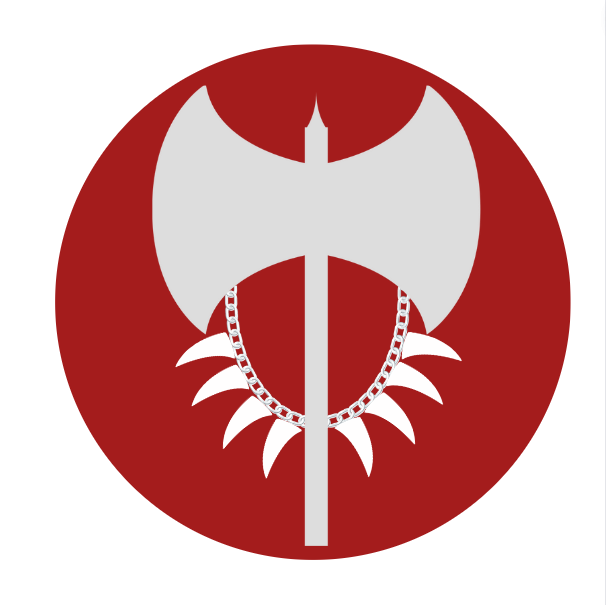

---
title: "Silvertusk Brotherhood"
sidebar_position: 1
---

The Silvertusk brotherhood is known throughout Norberia for the role it
played during the continent's great war against Marsander. Thanks to
their actions, the allied countries managed to swing the victory to
their side.

 

Now they are a mercenary band under the command of Guludur Silvertusk.
They make their living offering protection to caravans, or dealing with
monsters that threat settlements. They can be found all along Norberia,
working in small cells, which all then report to Guludur.

 

 

 

