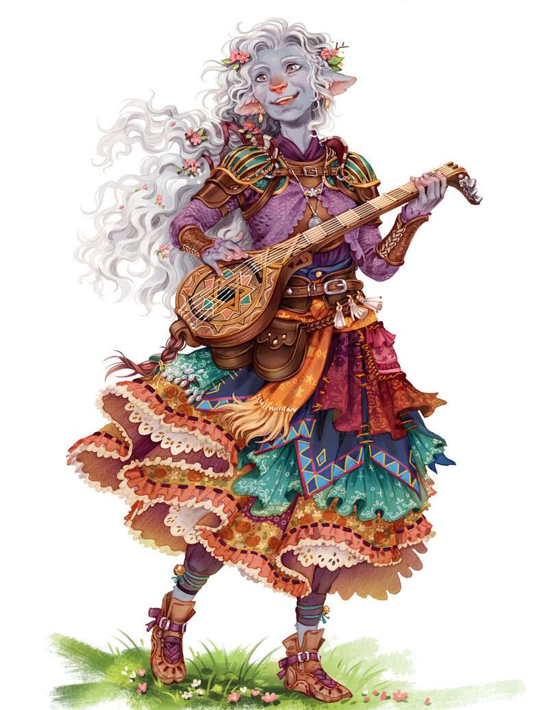

---
title: "Aurora, the elder"
sidebar_position: 3
---

She was the elder of the Wanderer's troup that the players met while
travelling to Longsaddle. She told the story of The
Sentinel
and asked them to not mention his name freely.

She told that the story was told to her from the majestic bard Abenthy.

