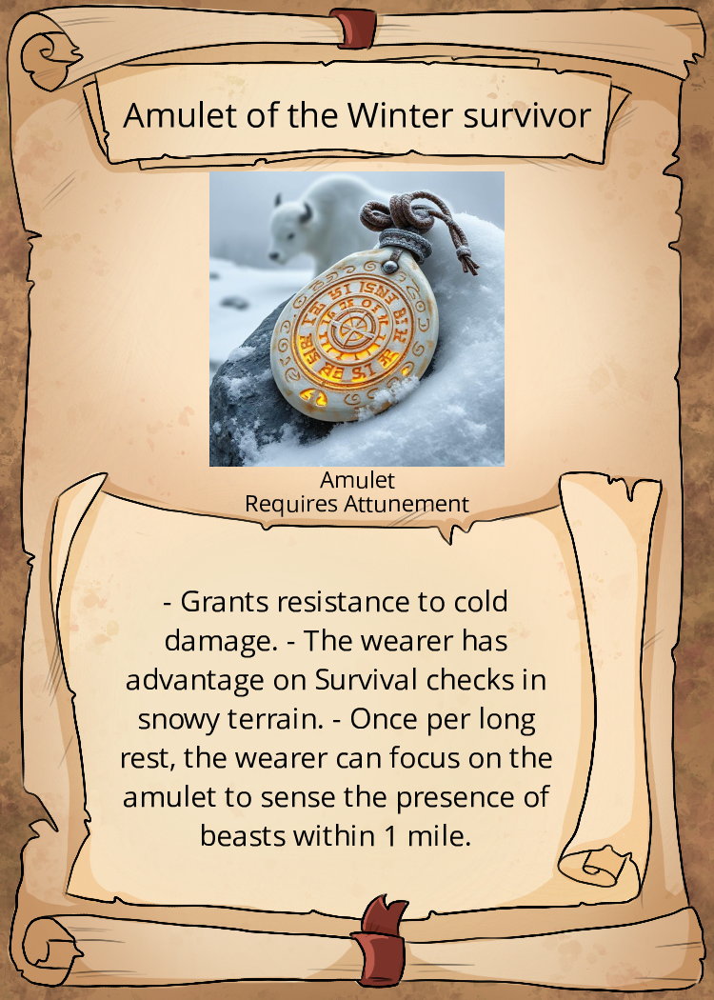
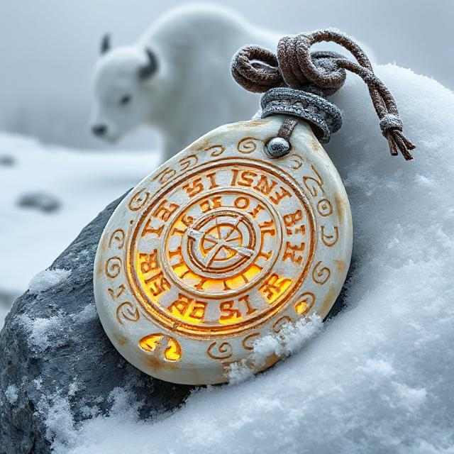

---
title: "Amulet of the Winter survivor"
sidebar_position: 10
---

Wondrous Item, Uncommon, Requires Attunement

This amulet is carved from the horn of a great fog bison, its surface
etched with swirling runes that seem to shift like blowing snow. The
leather cord is old but sturdy, braided with the fur of an unknown
beast. When worn, the amulet exudes a faint chill./
 

Properties:

- Grants resistance to cold damage.
- The wearer has advantage on Survival checks in snowy terrain.
- Once per long rest, the wearer can focus on the amulet to sense the
  presence of beasts within 1 mile, feeling their movements like a
  hunter tracking prey.
