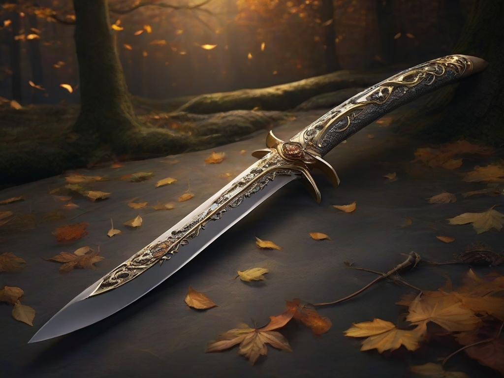

---
title: "Espina de Otoño"
sidebar_position: 2
---

Espina de Otoño, an exquisite scimitar with an ethereal aura, stands as
the sacred family relic of the venerable Herbsblatt lineage. Crafted by
the hands of master artisans and enchanted by generations of skilled
magicians, this blade bears the mark of a timeless legacy. Its hilt is
adorned with a delicate filigree of autumn leaves, forged from a rare
blend of enchanted metals that shimmer with a faint golden hue.

The blade itself possesses a distinctive curvature, echoing the elegance
of the scimitar, but its true power lies in the magical properties
infused within. Espina de Otoño is renowned for its exceptional ability
to combat the undead, a duty that has been the hallmark of the
Herbsblatt family for centuries.

It was sold to Ralto for 4.000 GP

