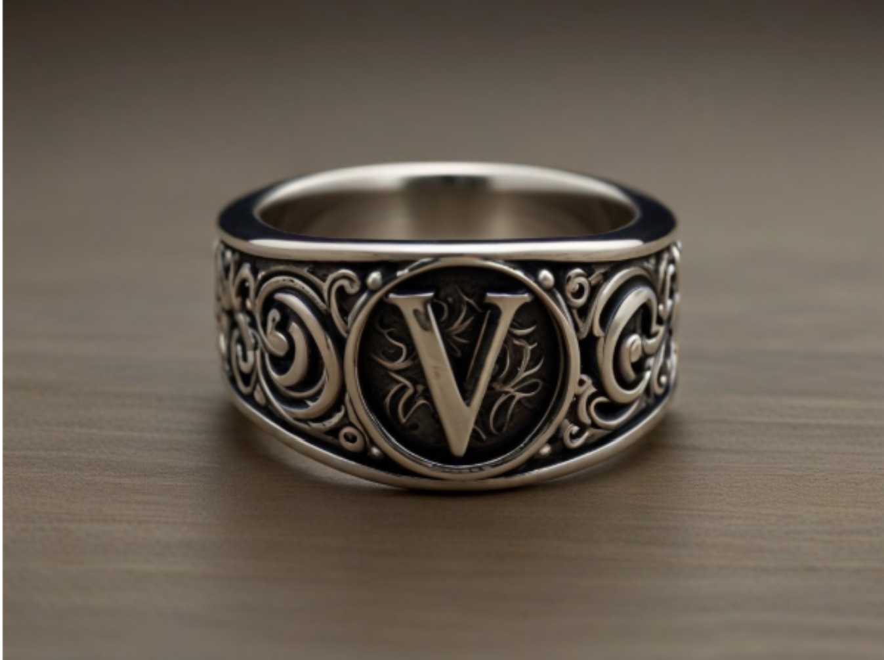

---
title: "Ring of quiet influence"
sidebar_position: 11
---

miércoles, 8 de mayo de 2024

Ring of Quiet Influence Wondrous item, rare (requires attunement)

 

 

This elegant silver ring features intricate engravings of swirling
patterns, leading to a prominent letter "V" etched into its surface.
When worn, it wraps around your finger with a sense of calm, imparting a
subtle but noticeable aura of confidence and persuasion. The ring grants
the wearer the following benefits while attuned:

- Enhanced Protection: The Ring of Quiet Influence grants you a +1 bonus
  to your Armor Class.
- Limited Disguise: While wearing the ring you can subtly change your
  appearance. You can change only the color of your skin, hair, and eyes
  to make them appear to be as a different one.
- Persuasive Presence: The ring allows you to cast the friends cantrip
  three times per day without expending any spell slots or material
  components. The ring recover the charges at dusk.
- Subtle Influence: Once per week, the ring allows you to cast the charm
  person spell at its lowest level without using a spell slot or
  material components. After the spell's effect ends, the target knows
  they were charmed. The ring recover the charges at the dusk of the 7th
  day after the use.
