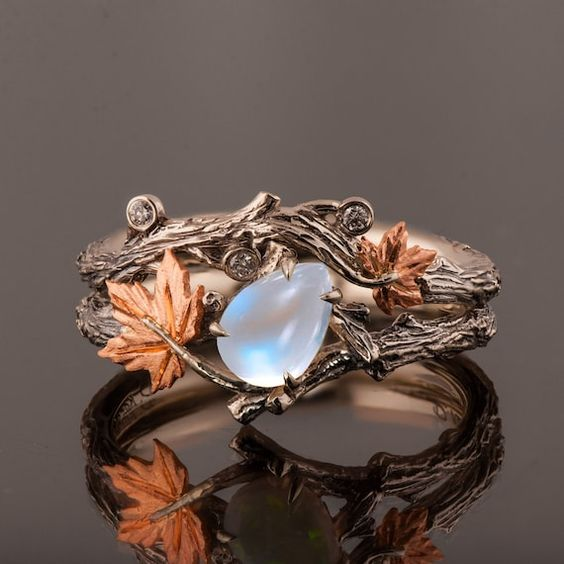

---
title: "Ring of Tranquil Shielding"
sidebar_position: 9
---

A golden ring with an embedded moonstone gem, this ring excludes

a calming presence when worn. Effect: As a bonus action, the wearer can
activate

the ring to create a shimmering, translucent shield of energy around an
ally within 30 feet. The shield provides temporary hit points equal to
1d10+ the wearer's Charisma modifier. These temporary hit points last
for 1 hour or until depleted.
