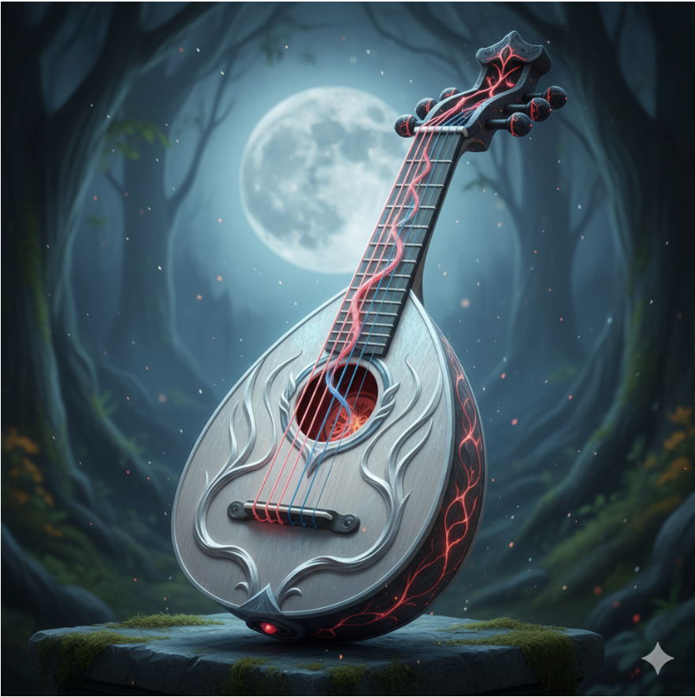

---
title: "The Moonweaver’s Lute"
sidebar_position: 13
---

Description

A masterfully crafted bardic lute whose body seems to hum faintly when
touched./
 

- Body: Hollowed from silver-barked heartwood. The grain shimmers
  faintly like frost.
- Strings: Fashioned from silk dyed in hues of shifting coral pink and
  deep ocean blue.
- Fretwork: Inlaid with steel. The polished metal reflects light as if
  it were liquid silver.
- Tuning pegs: Forged from cooled basalt, veined with red fire-opal./
   

 
