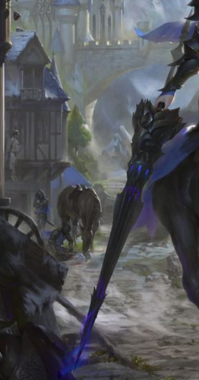

---
title: "Unheilmeer"
sidebar_position: 1
---

Seems to be the name of the Spear that Golt carries.

It seems to have a duality inside of it, being influenced by Golts
patron (Dagon) and his former deity (Selune). Dagon and Jori's mother
want the Unheilmeer to be brought to the Ipletherion.

