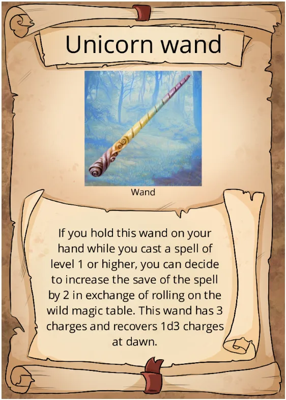

## Registered Effects

| Roll | Effect | Description|
|:---:|---|---|
| **6** | **Unlucky.** | You feel extremely unlucky. For the next **1d4 turns**, all rolls you make are made with disadvantage. |
| **9** | **Bubbles.** | You can't speak for the next **1 minute**. Whenever you try, pink bubbles float out of your mouth. |
| **13** | **Fireball.** | You cast *Fireball* as a **3rd-level spell**, centered on yourself. |
| **18** | **Iron Liver.** | You are immune to becoming intoxicated by alcohol for the next **5d6 days**. |
| **27** | **Snail Time** | You cast slow centered on yourself, affecting the maximum number of creatures possible.|
| **48** | **Jester's Wardrobe.** | All your nonmagical clothes are replaced by those of a jester. |
| **69** | **Stomach Trouble.** | You get a terrible stomach ache and fart, producing the effect of a *Stinking Cloud* centered on yourself. |
| **73** | **Rock Talk.** | You can understand nearby rocks. Unfortunately, they are bullies who relentlessly criticize your clothes. |
| **81** | **Silent Invisibility.**|  You become *invisible* for the next **1 minute**. During this time, other creatures can't hear you. The invisibility ends if you attack or cast a spell. |
| **89** | **Rise of the Dead.**| **1d4 skeletons** rise from the ground and attack the nearest creature. They remain until killed. |
