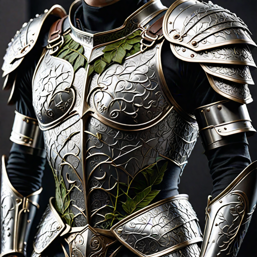

---
title: "Verdant Guardian"
sidebar_position: 4
---

Verdant Guardian is a set of finely crafted elven chainmail adorned with
intricate patterns of vines and leaves. The armor is lightweight and
flexible, allowing for swift movement while providing excellent
protection. It shimmers with a faint green hue, reminiscent of lush
forest foliage.

Scale Male stats made of big leaves/

Photosynthetic Resilience:

While wearing the Verdant Guardian Armor, the wearer gains the ability
to harness sunlight for minor self-healing. During a short rest spent in
direct sunlight or in a naturally illuminated area, the armor aids in
the wearer's natural healing process. The wearer regains an additional 1
hit point for each Hit Die spent during the short rest. This minor
regeneration does not function in darkness or artificial light.

Sylvan Concealment:
