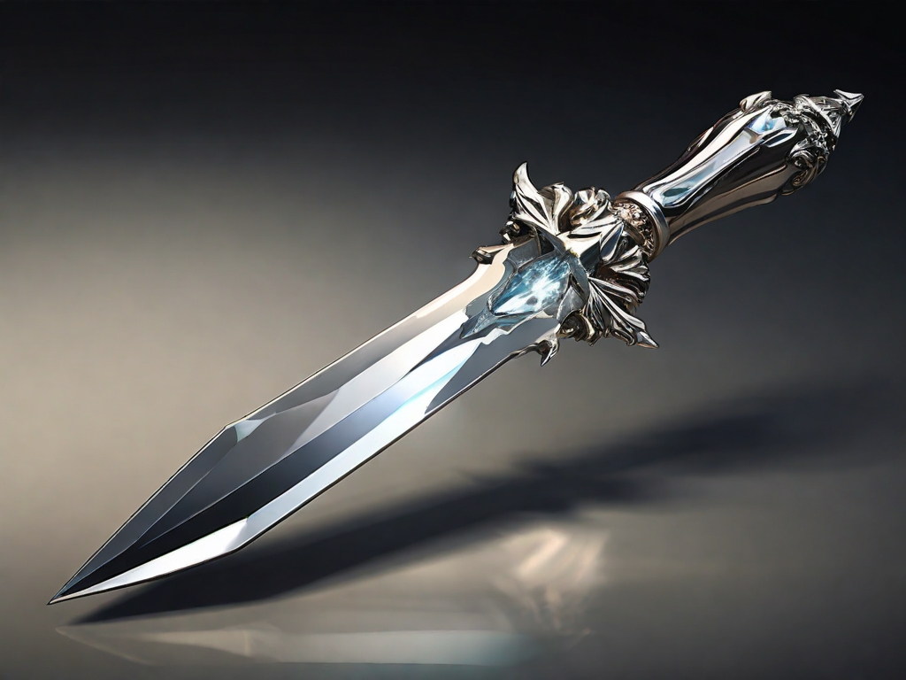

---
title: "Visionarie's Dagger"
sidebar_position: 3
---

This dagger is of excellent quality and has a transparent jewel in its
hilt. When someone weilds it, the jewel changes to the same color as the
wearer's eyes. Its blade gains an elemental affinity depending on the
color of the jewel.

 

It was sold to Ralto

The weapon does an additional 1 elemental damage based on the color of
the bearer's eyes:/
amber: lightning

black: necrotic

blue: cold

brown: force

green: poison

gray: thunder

hazel: acid

purple: psychic

red: fire

white: radiant
