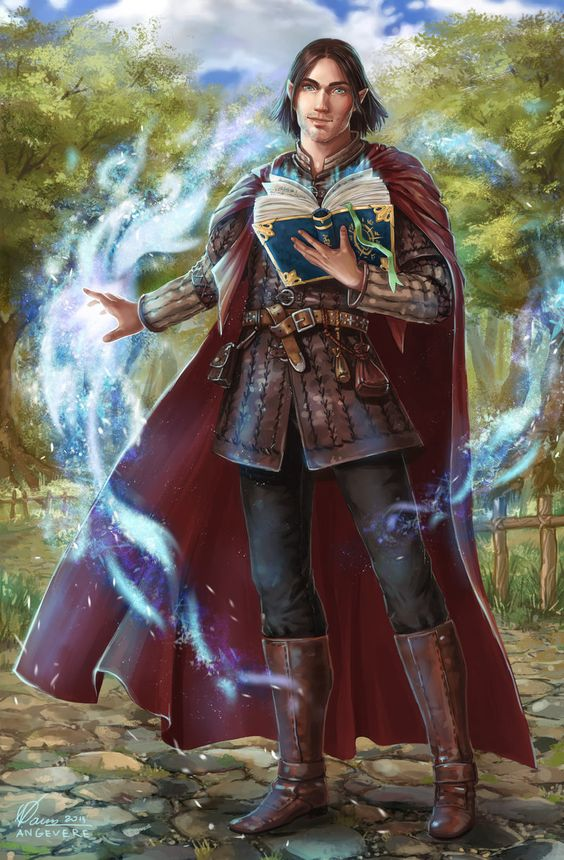

---
title: "Jhandril / Dash Virgula"
sidebar_position: 15
---

A young Half-Elf, he is the pupil of the Sacred Plume of Archaeomancy
and apparently a son figure to him.

He seemed to be quite shy.

He turned to be a Marsandian himself, son of Elipsis Virgula and a woman
named Sandria. He is therefore the nephew of Count Ponto Virgula.
