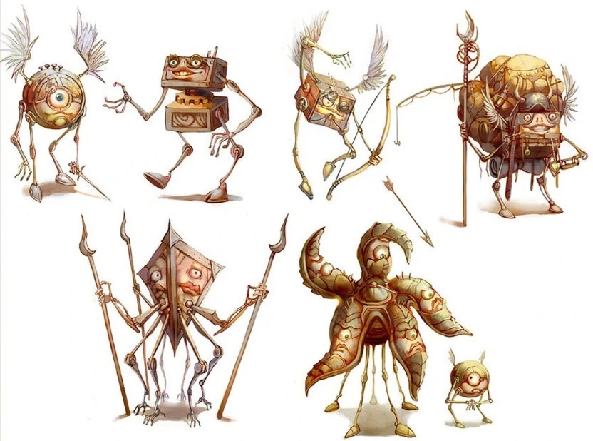

---
title: "Modrons"
sidebar_position: 14
---

Diminutive automatons known as Modrons, whispered to be the ancient
architects of the temple itself, tasked with the sacred duty of
gathering and safeguarding the repository of knowledge within its halls.
The mysteries surrounding these enigmatic constructs abound, as none can
fathom the precise nature of their origins or the purpose behind their
meticulous labors. Yet, their unwavering dedication to their appointed
tasks is undeniable, as they tirelessly catalogue the vast array of
tomes and manuscripts, maintaining the sanctity of the temple's archives
with unmatched efficiency.
