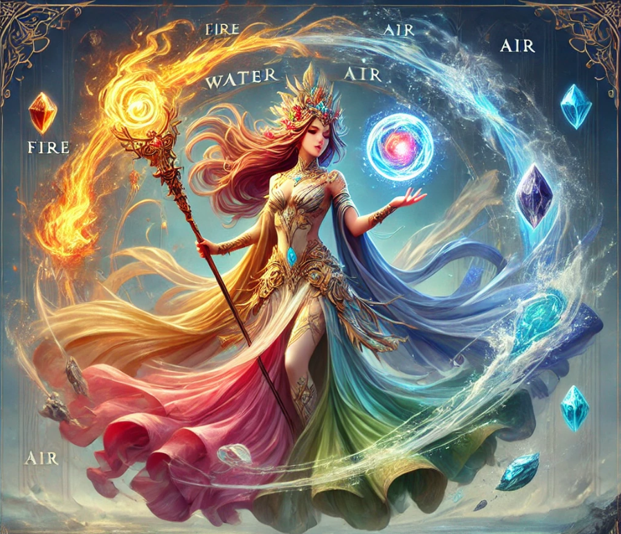

---
title: "Sacred Plume Melrea"
sidebar_position: 5
---

 

 

Melrea, a regal Janni and the Sacred Plume of Elemental Arts. She has
striking, otherworldly beauty with flowing, multicolored garments that
shimmer like fire, water, air, and earth. Her skin glows faintly with
shifting elemental huescrackling embers, rippling water, swirling dust,
and gentle breezes. Her hair floats as if underwater, threaded with tiny
crystals, feathers, and sparks. She levitates slightly above the ground.
In one hand, she holds a staff crowned with a crystal that contains a
miniature storm.
