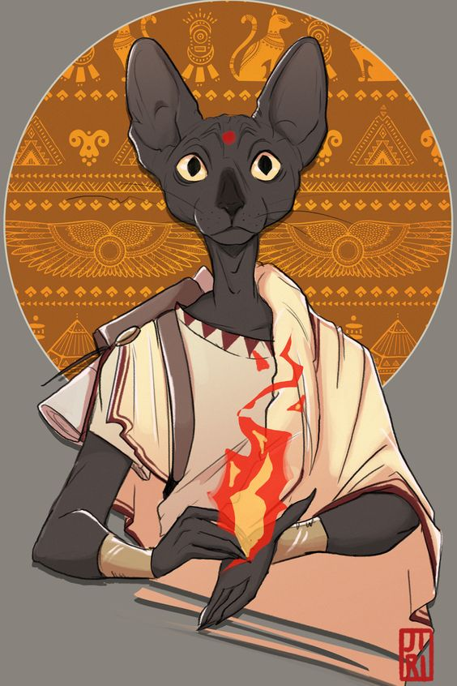

---
title: "Hatu-khnum-amen"
sidebar_position: 3
---

A soft-spoken but ever-alert Tabaxi from the golden dunes of Neu Samir,
walks with the calm elegance of one who observes before acting. Draped
in desert silks and adorned with intricate silver charms that jingle
softly as he moves, Hatu carries the scent of distant spices and the
warm wind of the east. He has crossed seas and borders not only to
master western customs, but to understand them�€”each conversation is,
to him, a chance to build a bridge. His voice is calm, precise, and
laced with a musical accent that makes even mundane topics sound
profound.

A student of diplomacy and nuance, Hatu-Khnum-amen sees the Temple of
Knowledge not just as a test of intellect, but as a proving ground for
his ideals. He is open-minded, inquisitive, and surprisingly
uncompetitive�€”more interested in learning from his peers than
outshining them. But don't mistake his gentleness for naivety: he is
deeply aware of the stakes in this cultural exchange, and behind those
patient golden eyes lies a sharp wit honed by a lifetime of navigating
subtle court intrigues. Hatu is here to listen, to connect, and perhaps
to remind others that knowledge is a conversation, not a conquest.
