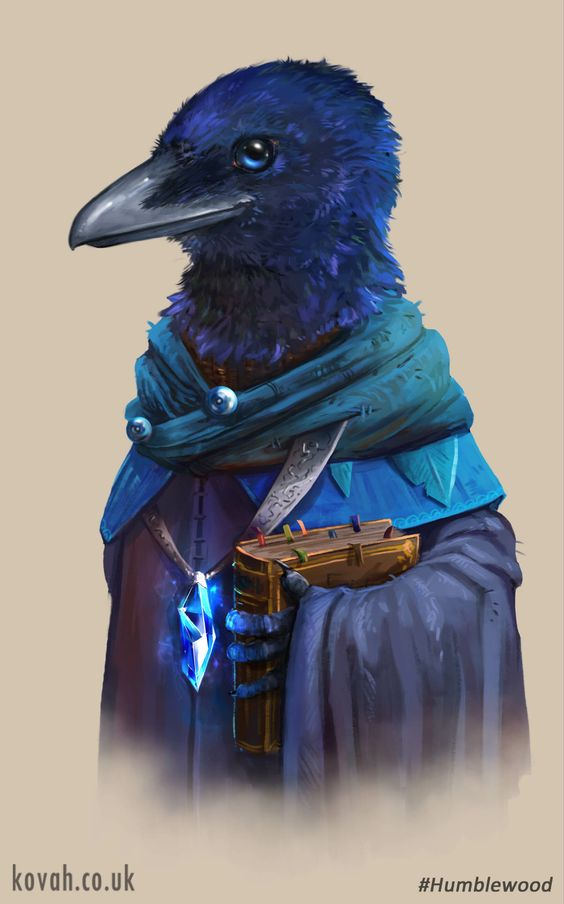

---
title: "Rabenax"
sidebar_position: 4
---

She is rarely the first one you notice in a crowded hall, but almost
always the last one you forget. Small, black-feathered, and hunched
slightly from years of mimicking posture as well as sound, this young
Kenku lingers in the edges of the Temple�€™s candlelit libraries, always
listening at every whispered secret and lecture alike. Though her beak
never forms original sentences, her mimicry is eerily perfect�€” she can
recall entire pages of texts, lectures, and even the subtle inflection
of a speaker�€™s doubt. There�€™s something uncanny about hearing the
stern voice of a Sacred Plume echo from Rabenax�€™s beak with such
precision that it�€™s hard not to glance around the room in confusion.

Despite the limits of her voice, Rabenax�€™s eyes gleam with quick wit
and quiet hunger for knowledge. Rumors swirl that she may be Eulius�€™s
ward or secret apprentice, a prodigy plucked from obscurity to be tested
among the best. She speaks little, but watches everything�€”and when she
does �€œspeak,�€? it's often with unexpected humor, mischief, or
perfectly timed insight. Her presence in the exam is as mysterious as
her past, but those who underestimate her quickly realize that silence,
too, is a kind of power.
