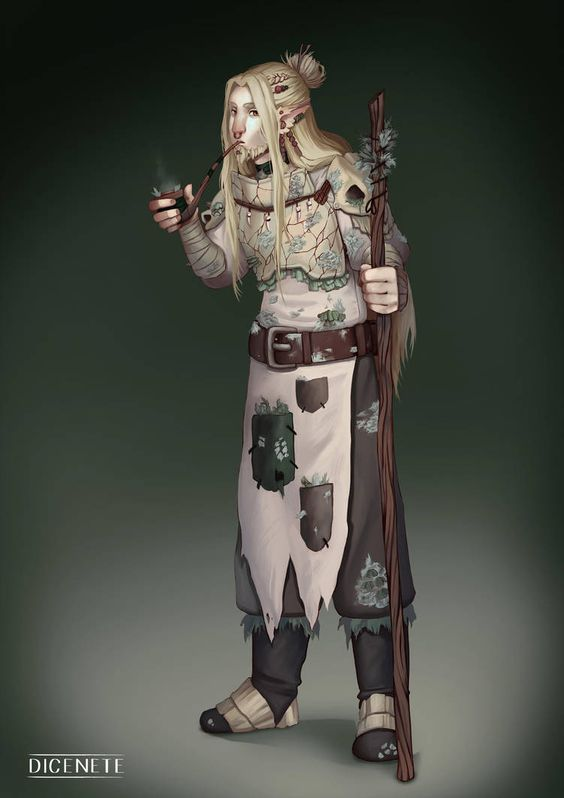

She is an oddity, even among Firbolgs. Towering over the other
applicants with moss and twigs in her hair, she speaks only in bursts of
two or three words—sharp, shrill, and with a voice that sounds more
like a startled forest bird than a creature of her stature. A devout
member of the Circle of the Green Antlers from the Crispy Woods, she
claims to speak for the roots, the sap, and the wind. She answers only
to the spirits of the woods and the whispering groves—and occasionally
to the moon.

Though Firbolgs are often known for their wisdom and quiet strength,
Zarzaparrilla is... different. There’s an edge to her curiosity, a
wild spark in her pale eyes. She didn’t come to the Temple of
Knowledge to study dusty books—she came because something in the soil
told her to. She listens more to bark than to teachers, and yet, her
knowledge of nature runs deep and strange. Students are often unnerved
by her silent stares and sudden pronouncements like “Too many
questions.” or “Tree remembers everything.” But make no
mistake—she’s here to win.
