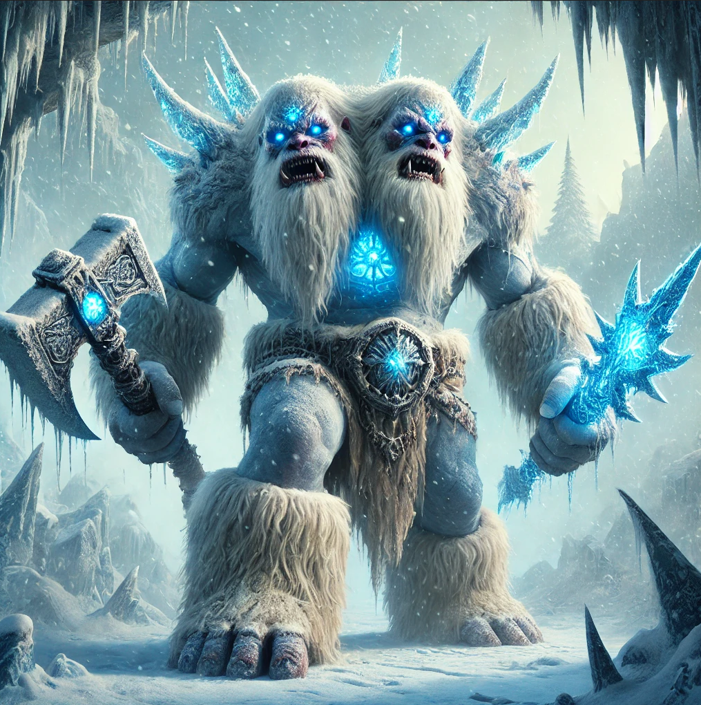

---
title: "Frostbound Ettin"
sidebar_position: 8
---

It lived in a cave somewhere at the base of the Nevington Mountains. It
had a winter wolf cub inside a cage, that turned to be something else.

It spoke a strange language but seemed not to be very intelligent. It
almost found the party in a fog cloud and fought against them.

It found Kespiens magical hut and tried to break it but couldn't.
