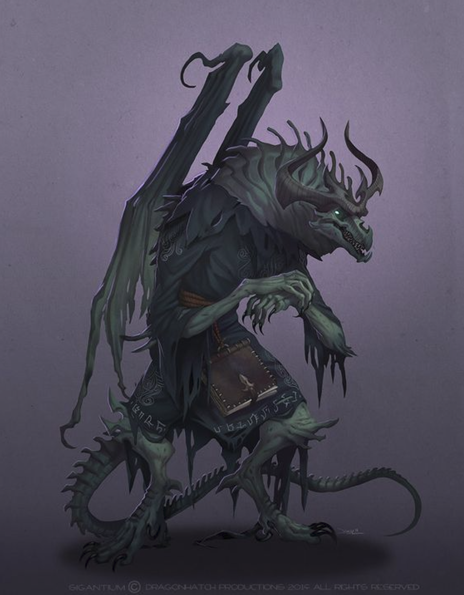

---
title: "Schwefel Sulphure"
sidebar_position: 1
---

sábado, 21 de febrero de 2026

He was riding a mausoleum being pulled by two large zombie ogres.

He also had a big entourage of zombified Radiant Lions and goblinoids
from the red fangs tribe.

He also had a double of himself, either created by magic or it was
indeed a twin.

 

He offered Virgula a deal to peek his memories about Marsander in
exchange of

Bringing back to life someone from this memories or his magical staff.

 

After the deal, he left for the Dunklelock in search of the Onix Bishop.

