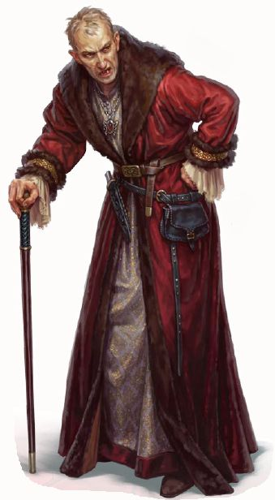

---
title: "Sir Hermenegildo H. Hermann"
sidebar_position: 3
---

He was seen discussing with the Sacred Plume Halphanis Severus.
Apparently he is some kind of Sir from Nersand. He apparently had slaves
under his command. As said by Jhandril he is some kind of important
sponsor of the Temple of Knowledge.
