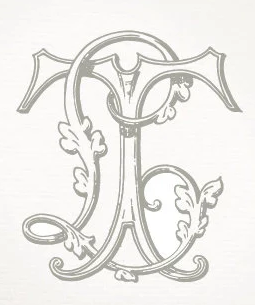

---
title: "The Shadow Auctioneer (T.L.)"
sidebar_position: 1
---

A mysterious individual who apparently handles with valuable items. He
managed to get a book from the private part of the Temple of Knowledge.

Golt recognized the initials of his sigil as T.L., a known criminal from
the days he was a Radiant Lion. For what he knows, he wasn't ever got
caught.

Aeriff overheard Silica Stein that an individual called Tom Lancil broke
into the Temple of Knowledge and managed to steal a book about creation
of magic weapons.

An individual named Thomas Lawson was the Seeker from the Silvertusk
Brotherhood that got the mission from Mr. Oaktree.

A travelling merchant that goes by the name Tobias Leclair was seen in
Orchiva and supposedly gave the book to Maximiliam.

