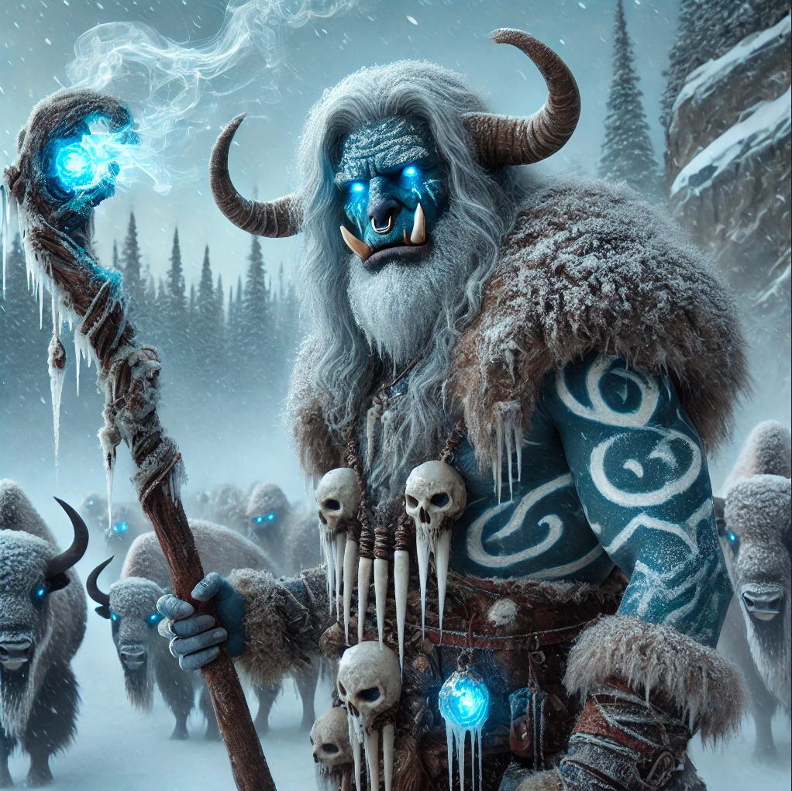

---
title: "Thrag"
sidebar_position: 9
---

It was pretending to be a winter wolves cub in a cage inside the Jotuns
cave. When the Jotun left the cave for fighting what seemed to be a
Wyvern, and just before Virgula gave him a potion of diminution he turn
back to his half orc form and then back into a rat form before starting
to run out of the cave.

When he escape he found the party again later on and explained that he
was the protector of the balance of the misty hill and specially the
protector of the herds of fog bisons. He opposes the carnage that the
winter wolves are perpetrating and wanted to use the Jotuns to balance
the scales of nature. For that he captured one of the winter wolves cubs
and make them believe that it was the Jotun who did it. With the hope
that the wolves would fight the Jotun and either run away to never
return or at least reduce their strenghts.

He agreed to help the party with obtaining the breath weapon of a winter
wolve if they help him restore the balance in the misty hills.

He appeared to control the bison's with some kind of charm. He was able
to turn himself into a fog bison. He had the wolve's cub polymorphed
into a mouse which he also charmed to do his bidding.

He gifted the group with winter clothing and a magic amulet.
