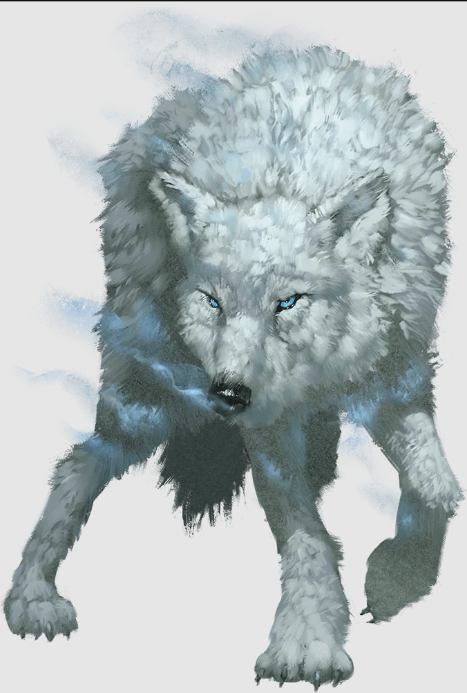

---
title: "Winter wolves"
sidebar_position: 10
---

A pack of winter wolves were found in the forest at the base of the
Wyvern Mountains.

The alfa male was called Moon Eyes, while the alfa female was called
Frozen Teeth.

They had four smaller wolves with them and forced the group to face the
Jotun to recover one of their own.
