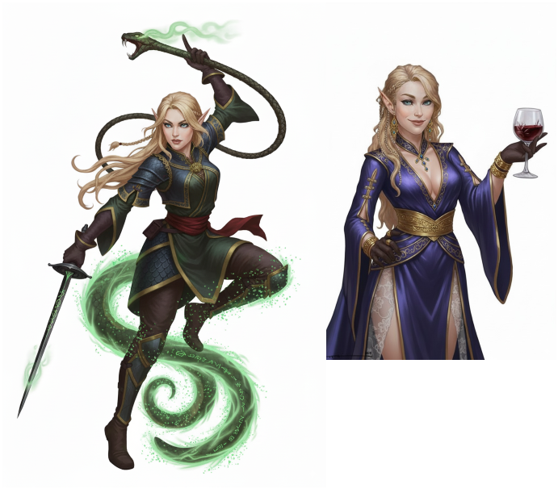

---
title: "Zyralis"
sidebar_position: 12
---

She claimed to come from Everlor and be some kind of noble elf. She
managed to trick Virgula intro drinking a Philter of love and questioned
him about the whereabouts of the Espina de Otoño. She seems to have some
kind of relationship with the Herzblatt family from Dorelta.

 

It was last seen in a room in the tavern the Broken Scale from
Longsaddle, where she teleported herself out with a portal.

