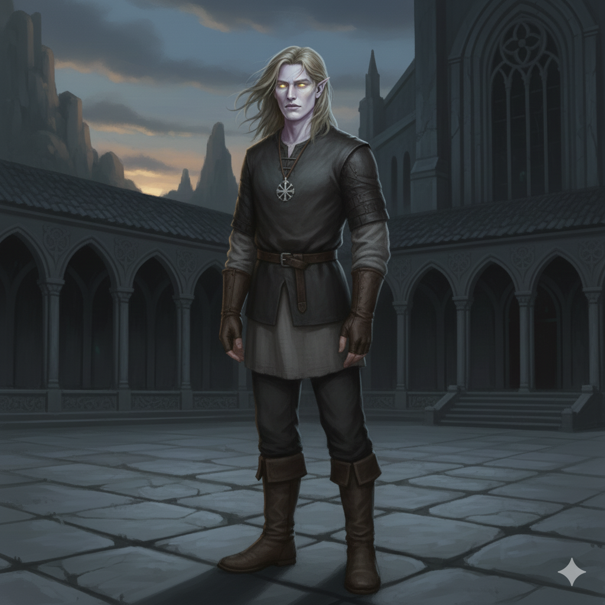
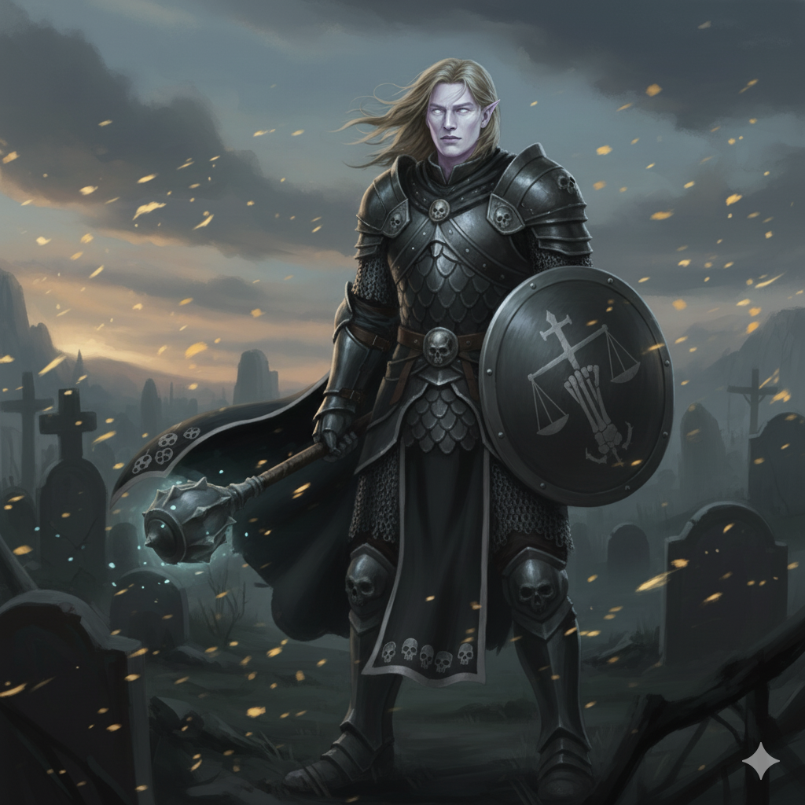
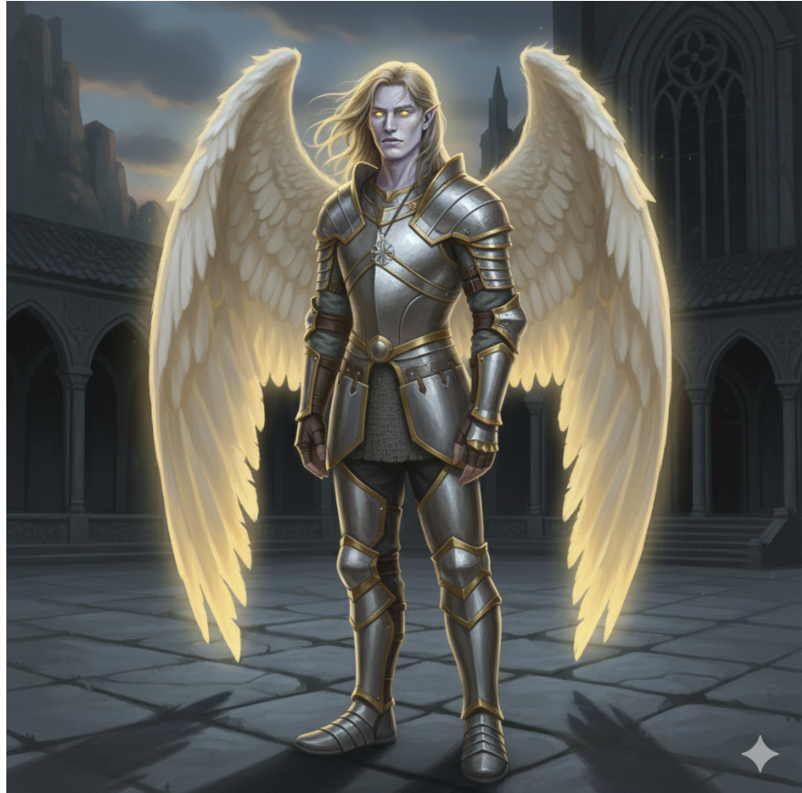

---
title: "Inus"
sidebar_position: 3
---

Member of the Order of the white Scale. Known in Orchiva as the pale
one.

He has been providing guidance for those whose end was about to come and
helping a little bit Sister Unvera. He doesn't really care about people
dying, he thinks that it is part of the cicle.

Finally it was discovered that it is not that he didn't care. He was a
Deva sent by Kelemvor with the command of destroying the book and not
meddle with mortal affairs. He just simply wasn't allowed to do it.

