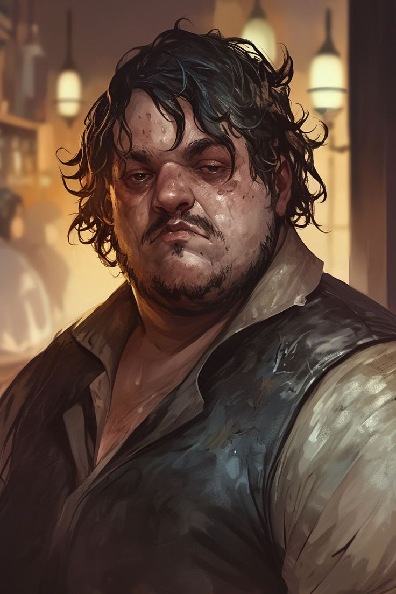

---
title: "Maximilian"
sidebar_position: 7
---

sábado, 7 de marzo de 2026

He is regarded as the idiot of Orchiva. He apparently was in love with
Rosaline.

He stole Abenthy's old lute for a travelling merchant named Tobias
LeClair in exchange for some expensive alcohol and a book of love poems.

He is being mentally tortured by the buzz and consumed by the plague.
