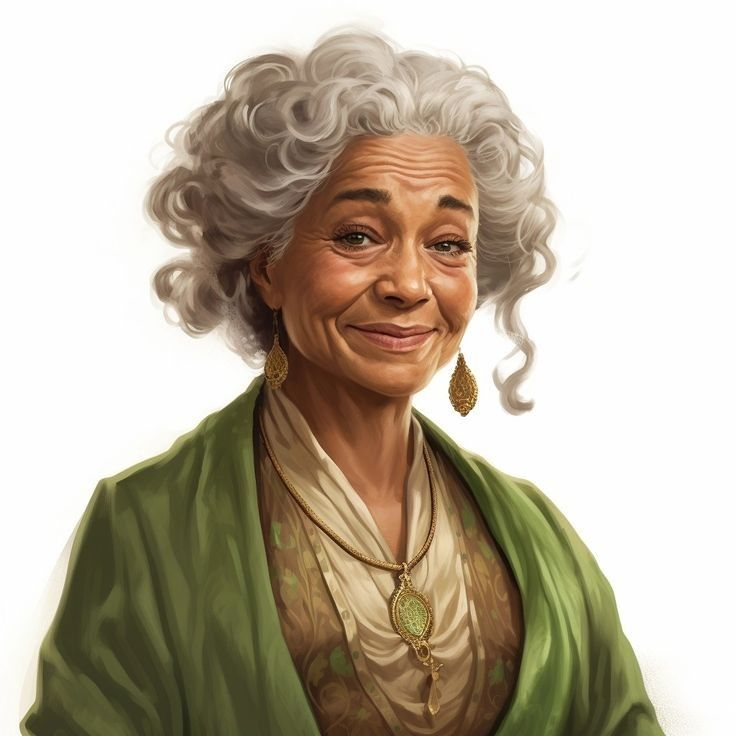

---
title: "Sister Unvera"
sidebar_position: 2
---

Halfling healer of Orchiva. She used to act as a veterinarian healing
the animals of the city when in need and attending complicated births,
but now she had to start treating also humans affected by the plague.

She is thankful for Inus and therefore don't want to join the other
citizen voices that blame him. She still thinks that his view of life is
very cold and a bit condescendent.

