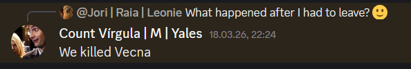

---
title: "18.03. How justified is ✨entering and a lil snooping✨ in the face of murderous demon-insects? "
sidebar_position: 7
---

18.03. How justified is �œ�entering and a lil snooping�œ� in the face of
murderous demon-insects?

Tuesday, April 28, 2026

6:37 PM

- Long rest
- Golt feels a presence in the back of his mind and has a vision of him
  standing at the shore with the Unheilmeer in his hand
  - The lance pulls him in the water, he gives in
  - Falling in the deep water, feels familiar
  - He feels a large shape moving in the water
  - Hears a voice in his head: "Enemy", "Close", "Consume", "Behave",
    "Obox'ob"=a name related to the Abyssal language
  - Massive kraken-like creature that reacts to the name "Dagon"
  - Golt wakes up wet from sea water
  - Golt talks to Unheilmeer: "I don't have a master, I want to feed on
    souls"
-  In the morning Lucien tells us rumors: a shadow figure lit candles
  next to the common grave, chanting
- We try to talk to Maximilian in the prison again:
  - Roy is angry that someone disturbed Rosaline's grave
  - Roy demands answers until this afternoon, threatens to kill
    Maximilian
  - Maximilian is unconscious, no thoughts
- We visit the graveyard
  - We find a black candle inside the common grave and boot footprints
    on the top of the hole next to more candle prints
  - We visit Rosaline's grave: 10 holes of something emerging from the
    ground -/> bugs hatching from the body?
- We visit the wood close to Inus' hut:
  - Jori tries to locate the book but does not sense it (only books in
    Inus' hut)
  - The others enter the cottage and find black candles and books about
    death rites, necromancy, curses, planar gates
  - Bookmark with crumbled paper covered in blood, letter from Rosaline
  - They are caught by Inus
  - Inus spoke to a merchant with fine clothes and bought a potion
    (presumably holy water)
  - Inus was sent by Kelemvor himself through a dream, waits until his
    time comes
  - Inus gave rites to prevent bodies rising as ghosts
  - Inus shows us the place where Rosaline was found but there is
    nothing there
- Commotion in the city center:
  - Maximilian broke out of the prison and killed the guard
  - Golt calms Roy, who demands answers
  - The metal bars were bent, the poor guard shows signs of the plague
    and choking
- We ride in the direction of Inus' home and follow a trail of insects
  leading to the graveyard
  - A shape is standing at Rosaline's grave: Maximilian consumed by the
    curse, Golt notices a fiendish presence
  - Insects are crawling out of the ground and attack us
  - Maximilian carries a scary-looking book and vanishes
  - Golt lands a critical hit to kill a huge scorpion
  - CV's unicorn wand slows the group
  - We defeat the insects...

...and another unimportant NPC (not canon):

