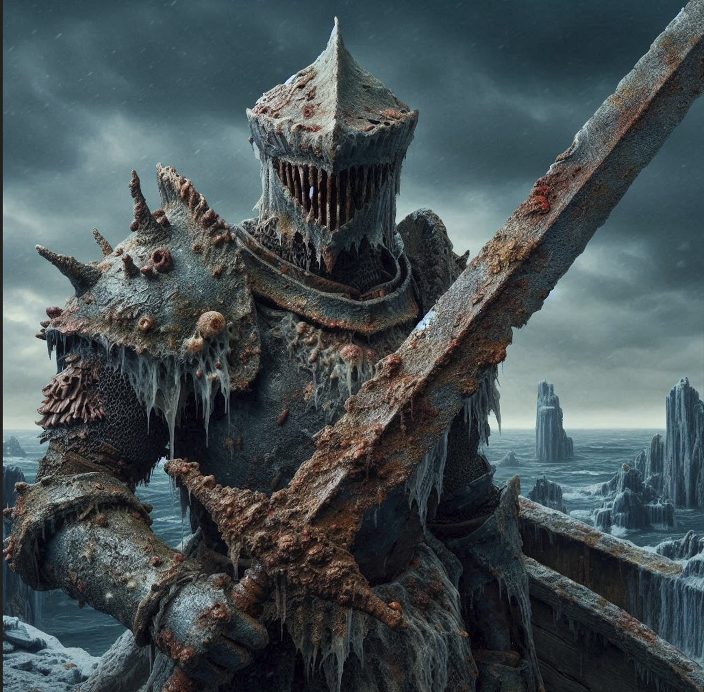
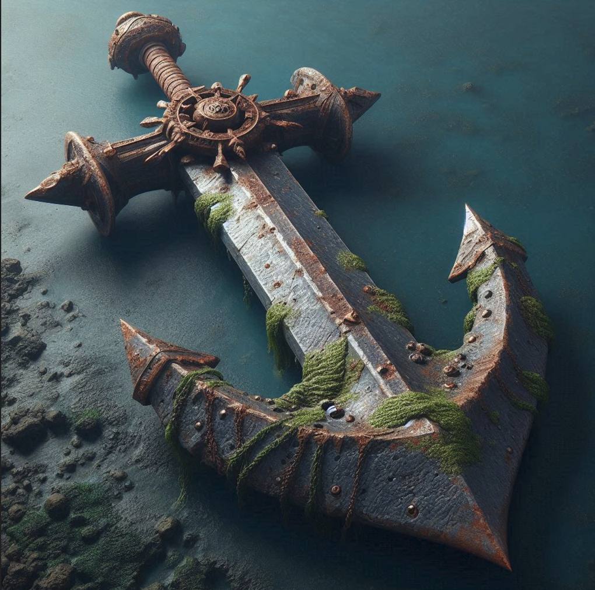

---
title: "The Sentinel"
sidebar_position: 6
---

It was mentioned by the elder of the wanderers
[Aurora](/docs/factions/the-wanderers/aurora-the-elder).
Apparently it is a dangerous and mysterious figure that creates havoc
and destruction wherever it goes. It has some connection to the sea.

There is a
[tale](/docs/documents/tale-of-the-sentinel)
about him.

A hulking knight clad in corroded plate armor, its metal swollen and
warped by seawater. A helm, shaped into the snarling visage of a shark,
hides its face�€”but not its teeth. Jagged. Too many. Yellowed and far
too long to fit a mortal jaw.

The stench of rot and brine rolls off of him like a thick fog. A corpse
bloated by the tide.

In his grip, he wields a massive rusted greatsword, its handle twisted
around the broken remains of a ship�€™s anchor. The blade drips
something darker than seawater.

