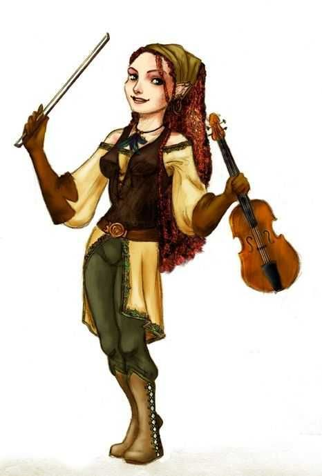

---
title: "Helene Soprani"
sidebar_position: 9
---

Young female Halfling with a marvellous voice. She seems to be an
acclaimed musician. She was seen for the first time in the tavern "The
broken Scale" singing the popular "[Belmont the
liar](/docs/players/kespien-belmont/belmont-the-liar-song)"
song.

She is apparently a friend of Jori from back in Mordian.

At some point she was travelling with someone named Connor who left for
Puerto Ballena.

She was tasked to write a song about the group (with some focus on
Aeriff) and their adventures in Dorelta.

She also didn't seem to be much concerned about singing the Belmont
song, since it was one of the audience's favourite.

