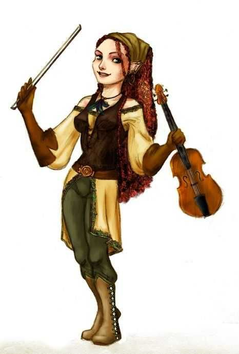

| | |
|---|---|
| **Race** | Halfling |
| **Occupation** | Musician |
| **Origin** | [Mordian](/docs/regions/mauer-mountains/mordian) |
| **Connection** | Childhood friend of Jori |

## Overview

Helene Soprani is a young halfling musician with a marvellous voice and an old friend of [Jori](/docs/players/jori/) from Mordian.

She was first encountered performing at [The Broken Scale](/docs/longsaddle/the-broken-scale-tavern/the-broken-scale-tavern.md), where she sang the popular [Belmont the Liar](/docs/factions/belmont-family/belmont-the-liar-song).

Helene was travelling with someone named **Connor**, who later departed for [Puerto Ballena](/docs/regions/puerto-ballena).

She was eventually tasked with composing a song about the group's adventures in Dorelta, with particular focus on Aeriff.

Despite the group's connection to Kespien, Helene had few reservations about performing *[Belmont the Liar](/docs/factions/belmont-family/belmont-the-liar-song)* after all, it was one of the audience's favourites.
