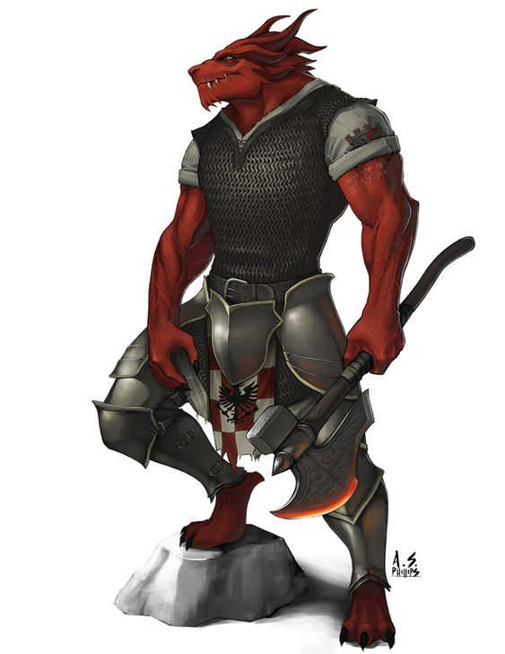

---
title: "Dorn Firember"
sidebar_position: 3
---

Thursday, November 30, 2023

3:14 PM

Kespiens tutor and boss from the Silvertusk Brotherhood. He taught
Kespien how to fight and inspire some of his spells in combat. He sent
Kespien to his first alone mission to Dorelta and told him to meet him
in Longsaddle afterwards.

When seemed to be extremely harsh to Kespien, like a very strict father.
He appreciates discipline and training.

