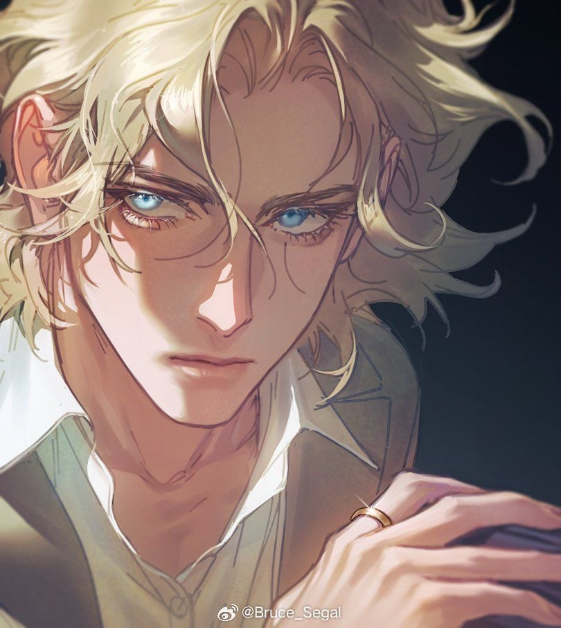

---
title: "Kespien Belmont"
sidebar_position: 1
---

Thursday, November 30, 2023

3:10 PM

Birthday 26.02

 

22-23 years old

 

Kespien Belmont was born in Crosscove—a modest town shadowed by the
infamous curse of the Belmont name. As a boy, he dreamed of adventure
alongside his best friend, Carter “The Cat,” despite the constant
ridicule his family endured. At thirteen, a disastrous goblin raid led
to the brutal death of his parents, leaving him orphaned and burdened
with guilt.

Rescued by Dorn Firember of the Silvertusk Brotherhood, Kespien was
taken under his wing and brought to Mordian. There, under Dorn’s
rigorous training and with the invaluable guidance of halfling rogue
Lory Swiftwind—who taught him to rely on agility and speed—Kespien
transformed from a frail, impulsive youth into a fit and determined
Bladesinger. He even devised his unique Bladesong to make up for his
lack of brute strength.

 

 

Kespien Belmont is a striking figure standing around 175 cm tall, with a
slim, muscular build that emphasizes agility over brute strength. His
medium-length blonde hair frames his face, and his dark blue eyes glow
faintly with a blue-purplish light whenever he concentrates on his
spells—a subtle yet captivating hint of his arcane power. A mild burn
scar on his chest, the lingering mark of a near-fatal blow from a fire
elemental, serves as a testament to the perils he has faced.

Favoring practicality blended with a sense of legacy, Kespien dresses in
well-worn traveling clothes. He wears a loose, bright shirt under a
finely embroidered jacket and cloak. The jacket prominently features the
Belmont crest—a blue shield adorned with a silver sword, from which
elegant silver lines flow in an artistic design. His attire is completed
by slim dark pants and dark brown boots that reach his knees, perfect
for enduring long journeys.

Kespien is rarely seen without two treasured items: a scorched spellbook
that once belonged to his mother, Victoria, and a broken longsword
inherited from his father, Jean. The longsword, marked by the Belmont
crest along its blade, not only symbolizes his family's storied past but
also serves as a constant reminder of the legacy and burdens he carries.

 

HP for Level 7: 6

 
