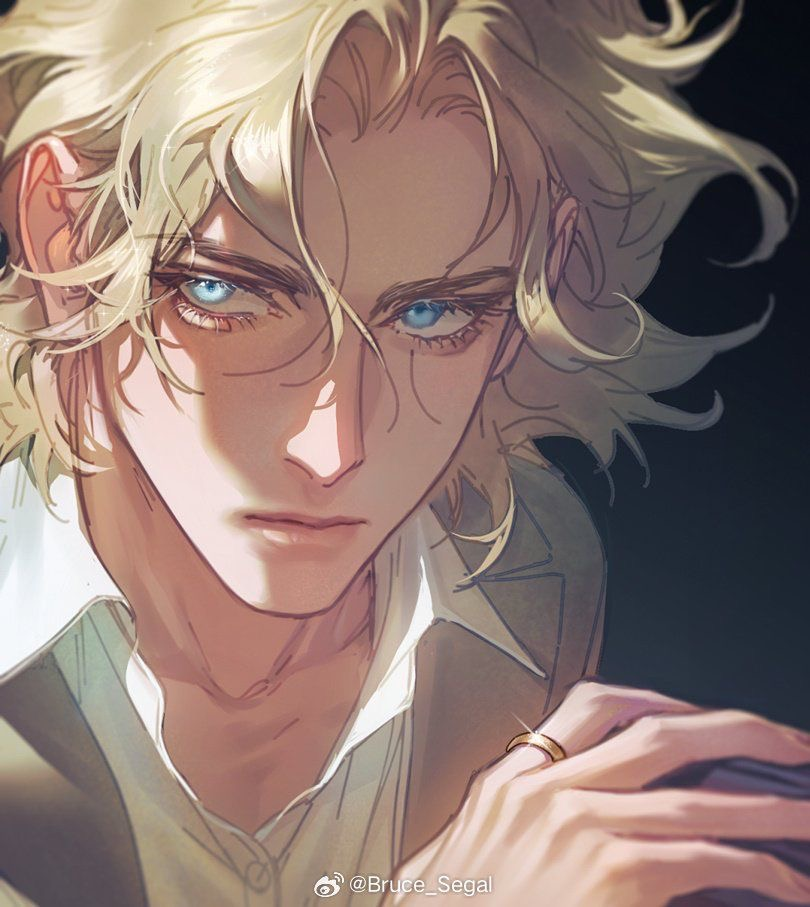

---
title: "Kespien Belmont"
sidebar_position: 1
---

| | |
|---|---|
| **Race** | Human |
| **Class** | Bladesinger Wizard |
| **Origin** | [Crosscove](/docs/regions/mauer-mountains/crosscove) |
| **Affiliation** | Farbound Fellowship |
| **Birthday** | 26.02 |
| **Age** | 22–23 |
| **Main Goal** | Restore the Belmont legacy |

> *A Belmont burdened by the past, determined to forge a different legacy.*

## Overview

Kespien Belmont is a human Bladesinger from [Crosscove](/docs/regions/mauer-mountains/crosscove), born into a family whose name had become synonymous with ridicule and misfortune. Orphaned during a goblin attack at thirteen, he was rescued by [Dorn Firember](/docs/factions/silvertusk-brotherhood/dorn-firember) and eventually trained to combine arcane magic with the speed and precision of swordplay.

Now an adventurer of the **Farbound Fellowship**, Kespien carries both the remnants of his parents and the burden of the [Belmont Family](/docs/factions/belmont-family/) name with him.

---

## Background

### The Belmont Name

Kespien was born in [Crosscove](/docs/regions/mauer-mountains/crosscove), a modest town overshadowed by the infamous reputation of the [Belmont Family](/docs/factions/belmont-family/).

Despite the ridicule surrounding his name, Kespien dreamed of becoming an adventurer. As a child, he shared those dreams with his best friend, [Carter "The Cat"](/docs/puerto-ballena/carter-the-cat).

### The Goblin Raid

When Kespien was thirteen, Crosscove suffered a devastating goblin raid.

His parents, [Jean Belmont](/docs/factions/belmont-family/jean-belmont) and [Victoria Belmont](/docs/factions/belmont-family/victoria-belmont), were brutally killed during the attack, leaving Kespien orphaned and burdened by guilt.

The event would shape much of the person he eventually became.

### Dorn Firember

Kespien was rescued by [Dorn Firember](/docs/factions/silvertusk-brotherhood/dorn-firember), a member of the [Silvertusk Brotherhood](/docs/factions/silvertusk-brotherhood/), who took the young Belmont under his wing and brought him to [Mordian](/docs/regions/mauer-mountains/mordian).

Under Dorn's rigorous training, Kespien began transforming from a frail and impulsive boy into a disciplined adventurer.

Dorn became one of the most important figures in Kespien's life and the mentor who set him on the path he follows today.

### Becoming a Bladesinger

Kespien's training was complemented by the guidance of the halfling rogue [Lory Swiftwind](/docs/factions/silvertusk-brotherhood/lory-swiftwind).

Rather than relying on physical strength, Lory taught him to depend on **agility, speed, and precision**.

Kespien eventually combined those lessons with his arcane studies, developing his own style of **Bladesong** to compensate for his lack of brute strength.

---

## Appearance

Kespien stands around **175 cm tall**, with a slim, muscular build suited to agility rather than raw strength. He has medium-length blond hair and dark blue eyes that glow faintly blue-purple when he concentrates on his magic.

A mild burn scar across his chest remains from a near-fatal encounter with a fire elemental.

His travelling clothes combine practicality with pride in his heritage. His jacket bears the [Belmont Crest](/docs/factions/belmont-family/belmont-s-crest): a blue shield crossed by a silver sword, surrounded by flowing silver ornamentation.

---

## Family Legacy

Kespien carries two possessions of particular importance:

- His mother [Victoria's](/docs/factions/belmont-family/victoria-belmont) scorched spellbook.
- His father [Jean's](/docs/factions/belmont-family/jean-belmont) broken longsword, bearing the [Belmont Crest](/docs/factions/belmont-family/belmont-s-crest).

Both are reminders of the family he lost, but also of the legacy he continues to carry.

---

## Goals

- Restore dignity to the [Belmont Family](/docs/factions/belmont-family/) name.
- Continue developing his unique **Bladesong**.
- Preserve the legacy of his parents.
- Grow beyond the guilt and consequences of his past.
- Protect the **Farbound Fellowship**.

---

## Related NPC's

| Character | Connection to Kespien |
|---|---|
| [Jean Belmont](/docs/factions/belmont-family/jean-belmont) | Father |
| [Victoria Belmont](/docs/factions/belmont-family/victoria-belmont) | Mother |
| [Carter "The Cat"](/docs/puerto-ballena/carter-the-cat) | Childhood best friend |
| [Dorn Firember](/docs/factions/silvertusk-brotherhood/dorn-firember) | Mentor and superior in the Silvertusk Brotherhood |
| [Lory Swiftwind](/docs/factions/silvertusk-brotherhood/lory-swiftwind) | Mentor who taught him to rely on agility and speed |
| [Chimney](/docs/players/kespien-belmont/chimney) | Familiar |
| [Ariana Stormbringer](/docs/factions/silvertusk-brotherhood/ariana-stormbringer) | Companion |
| [Gareth Stonefist](/docs/factions/silvertusk-brotherhood/gareth-stonefist) | Companion |
| [Dorn's Tabaxi](/docs/factions/silvertusk-brotherhood/dorn-s-tabaxi) | Mysterious Tabaxi associated with Dorn |

---

## Related Pages

| Page | Content |
|---|---|
| [Belmont Family](/docs/factions/belmont-family/) | Kespien's family history and legacy |
| [Belmont's Crest](/docs/factions/belmont-family/belmont-s-crest) | The crest of the Belmont family |
| [Belmont's Blitz](/docs/players/kespien-belmont/belmont-s-blitz) | Kespien's custom spell |
| [Belmont the Liar](/docs/factions/belmont-family/belmont-the-liar-song) | A popular song responsible for part of the Belmont family's reputation |
| [Farbound Fellowship Symbol](/docs/players/farbound-fellowship-symbol) | Symbol of Kespien's adventuring party |
| [Birthday Sending from Dorn](/docs/players/kespien-belmont/birthday-sending-from-dorn) | A personal birthday message from Dorn |
| [Spellbook Transcription Progress](/docs/players/kespien-belmont/spellbook-transcription-progress) | Kespien's spell transcription rules and progress |