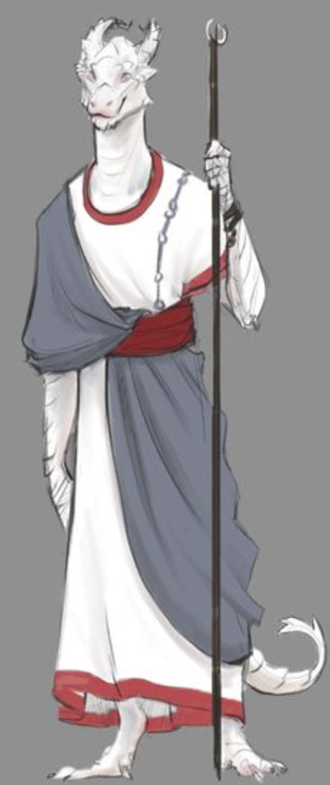

---
title: "Elisabeth the Twilight Oracle"
sidebar_position: 2
---

A white dragonborn that seems to have a close connection to Sacred Plume
Silica Stein. She is according to Silica the greatest specialist is
curses that exist currently in Norberia. She examined Golt and told him
how, from her point of view, he could break his curse.

She also had a vision while in touch with Jori in which she saw a group
of 5 individuals who called themselves the Crescent Wave. She told Jori
to visit her in Puerto Ballena where she hopefully would have more
information about whoever they were.
