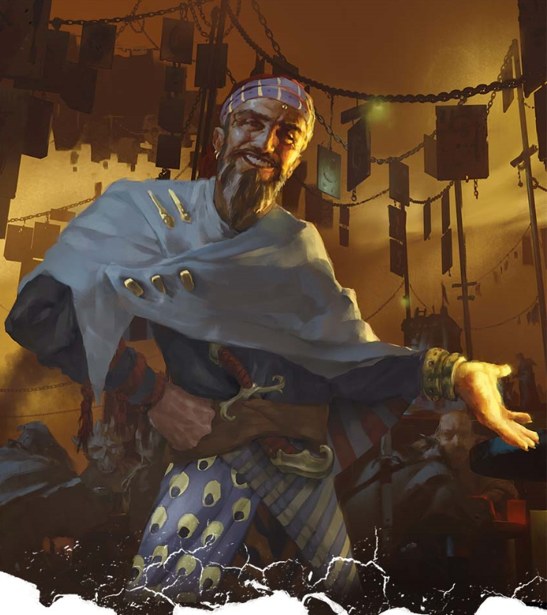

---
title: "Ralto"
sidebar_position: 1
---

Thursday, May 16, 2024

9:31 AM

Ralto is "apparently" an interplanar merchant. He travels using a big
snail in which he stores several valuable magic items.

When he met the group, he offered them to retrieve some metal in
exchange of one of the items he had in store and access to his
interplanar bazar.

For that he gave them a little snail which he would use to let them know
when the retrieval mission should start.

Jori and Aeriff noticed that when he shook hands, Ralto seemed to have
his thumb misplaced, as if he would have been using the opposite hand.

According to some information given by Sacred Plume Silica Stein, if
what Jori sensed was right, Ralto could be a Rakshasa in disguise.

Rakshasas are very powerful devils that like to accumulate magical
items. They are innately immune to many magic and can read minds. Unlike
other devils, they do not always handle with souls.
