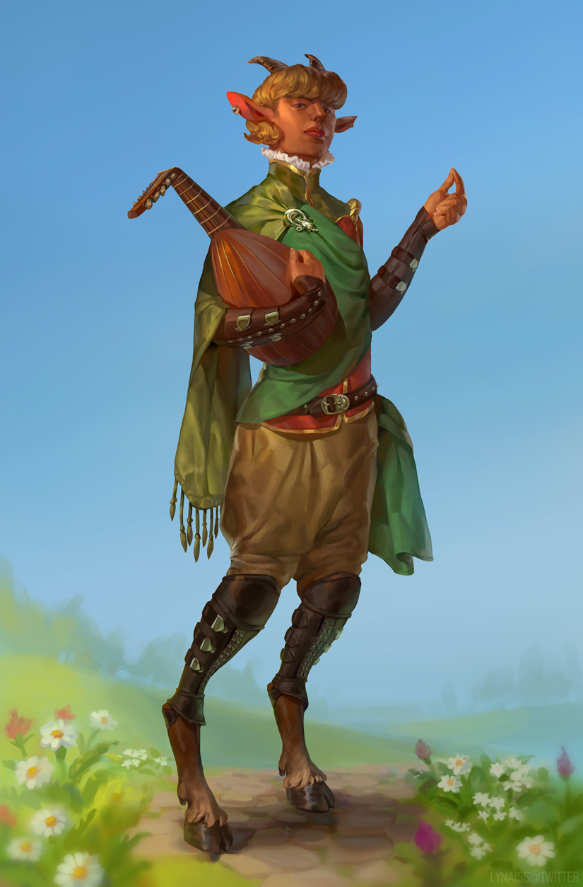

---
title: "Socration"
sidebar_position: 6
---

He is another merchant that has placed his shop on Ralto's bazaar. He
handles with books, music instruments and spell scrolls.

Spell Scroll prices and probability:

Cantrip 30 gp

1st 50 gp

2nd 120 gp (80% have the spell you want)

3rd 300 gp (50% have the spell you want)

4th 750 gp (30% have the spell you want)

5th 1500 gp (10% have the spell you want)

A check for a certain spell can be done only 1 time pers visit to the
Bazar.

If the spell has consumable components the price might be increased.
