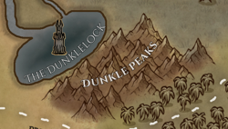

---
title: "Dunklelock"
sidebar_position: 1
---

One of the great lakes of Norberia, fed by water from the River Forgan.

Due to the proximity to the Marsander Shadows, their waters are also
affected by the same corruption and its waters are said to be infected
with horrendous monsters.

In the center of the lake there is a gigantic tower known as the Onyx
Bishop and it is said to be the home of a powerful female archmage.
