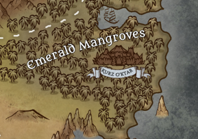

---
title: "Emerald mangroves"
sidebar_position: 1
---

They are mangroves infested with monsters and vermin. It is said that
somewhere in its depths there is a city of monsters named Kurz O'ktar.
The Emerald Watchers try to keep the monsters at bay to protect the
Prime Road.
