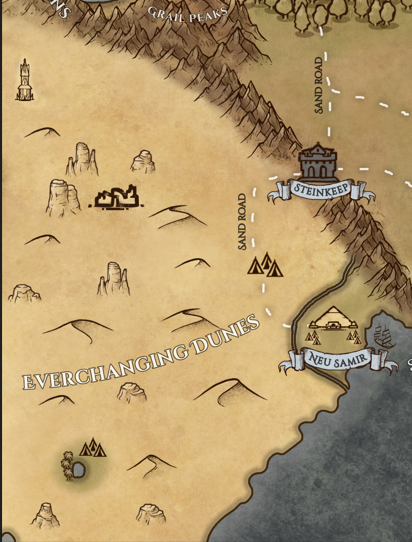

---
title: "Everchanging dunes"
sidebar_position: 1
---

This enormous desert is located on the other side of the Mauer
Mountains.

Its extension is almost the half of the whole Norberia alone. They
receive their name because the winds are continually changing the
landscape, making it almost impossible to orient yourself among its
dunes.

It is said that anyone who does not have a Samiran as a guide will find
death in the dunes.

In addition to the big capital of Neu Samir, in its dunes there are many
nomadic tribes that subsist in small oases and caves.
