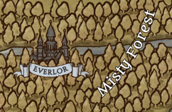

---
title: "Everlor"
sidebar_position: 10
---

Located in the center of the Misty Forest, Everlor is the great capital
of all the elves of the continent of Norberia. Although there are elves
who have been born and raised in other cities, most have a common origin
in Everlor. Few other races are welcome in Everlor as the elves guard
their secrets with great privacy.

Everlor is said to be the most beautiful city that human eyes can see,
built on enormous trees as old as the first of the elves.
