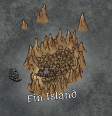

---
title: "Fin Island"
sidebar_position: 11
---

Until the recent discovery of the new continent of Lútaca, it was
believed that it was the end of the known world and that beyond it there
was only sea.

It is the home of numerous retired sailors and pirates looking to spend
their last quiet days away from the mainland. It is also the place
chosen by those who have to disappear for a season or even forever to
safeguard their lives.

After the discovery of Lútaca, Nersand is trying to rebuild Fin Island
into a middle port between the new continent and Norberia, which has
increased the interest of numerous sailors and has seen its population
increased exponentially.
