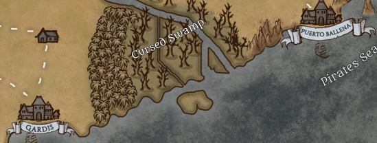

---
title: "The cursed Swamp"
sidebar_position: 2
---

 

Located between Gardis and Puerto Ballena, the cursed swamp receives its
name from the legend that witches live there and that they are capable
of casting curses that last for several generations.

 

Numerous monsters live there and it is generally an area to be avoided
by all Norberians.
